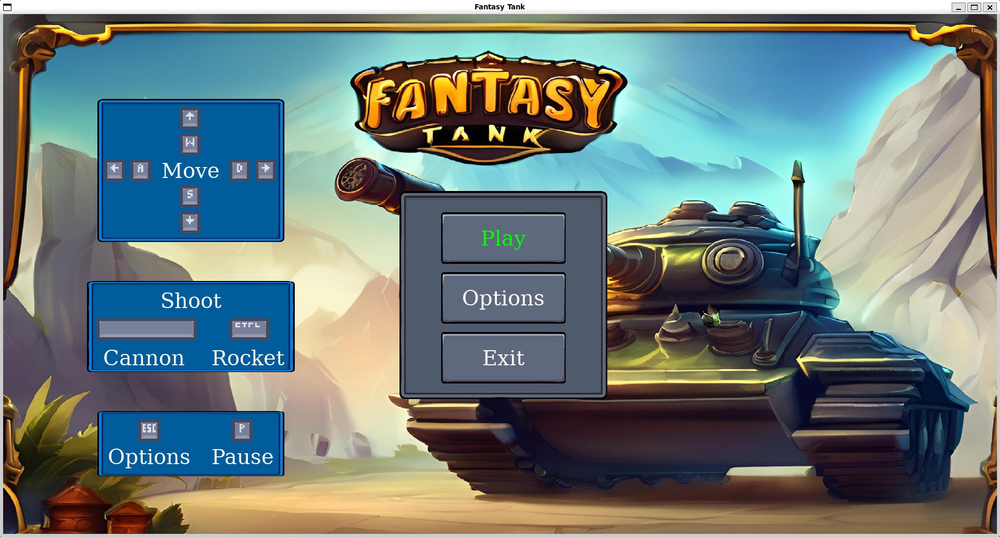
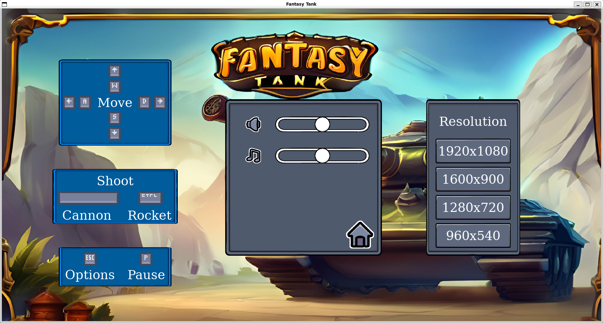
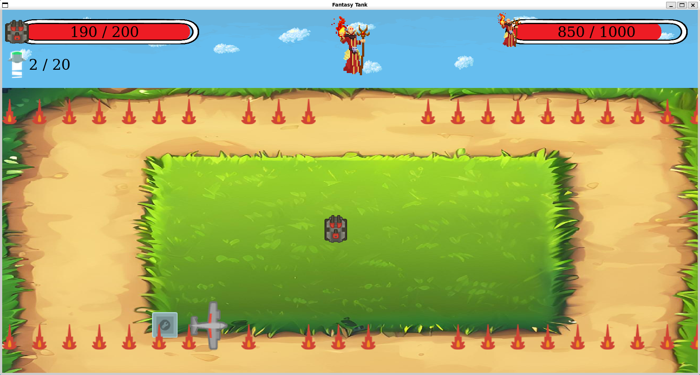
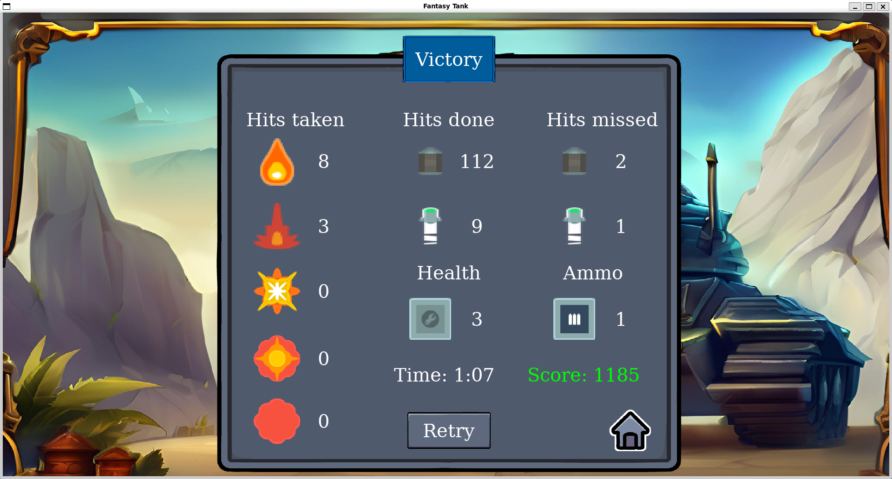

# fantasy-tank
My first personal project, created while learning to code at Boot.dev.
In this game, you'll take control of a tank, dodge enemy attacks, and use your firepower to defeat the wizard boss.

## Installation
## Option 1: Run the Executable (Linux)
1. Download the latest .zip file from the [Releases Page](https://github.com/marcelmit/fantasy-tank/releases).

2. Extract the .zip file.

3. Run the game by double-clicking the fantasy-tank.exe. No installation required!

## Option 2: Run the Game via Python
1. Clone the repository:
   ```bash
   git clone https://github.com/yourusername/fantasy-tank.git
   cd fantasy-tank
   ```

2. Install the dependencies:
   ```bash
   pip install -r requirements.txt
   ```

3. Run the game:
   ```bash
   python main.py
   ```

## Screenshots
Main Menu


Options Menu


Battle Screen


Victory Screen


## Credits
- **Art**: [LuizMelo](https://luizmelo.itch.io/evil-wizard)
- **Art**: [Penzilla](https://penzilla.itch.io/basic-gui-bundle)
- **Art**: [Szadi art.](https://szadiart.itch.io/background-desert-mountains)
- **Art**: [Kenney](https://kenney.nl/assets/tower-defense-top-down)
- **Art**: [Kenney](https://kenney.nl/assets/tanks)
- **Art**: [Kenney](https://kenney.nl/assets/input-prompts-pixel-16)
- **Art**: [Kenney](https://kenney.nl/assets/top-down-tanks-redux)

- **Sound**: [sixdots_soft](https://sixdots-soft.itch.io/tank-shooter-sound-effects)
- **Sound**: [LastDayDreaming](https://lastdaydreaming.itch.io/elemental-magic-fire-attacks)

- **Music**: [Sara Garrard](https://sonatina.itch.io/infinity-crystal)